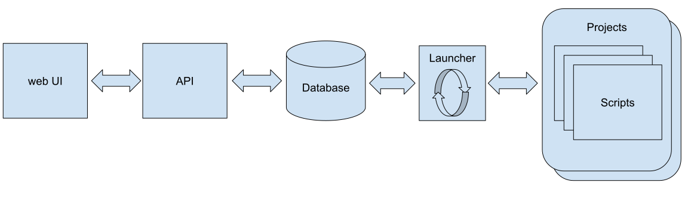

# Компоненты системы автоматизации

### Launcher (Планировщик)

Главный сервис фреймворка, который в бесконечном цикле:

- обновляет информацию о статусе работающих Обработок и Скриптов
- на основе анализа этой информации определяет следующий Скрипт для запуска
- запускает Скрипт с параметрами События
- исполняет команды управления

### База Данных (Database)

- хранит всю информацию о конфигурации и текущем состоянии Системы
- передает команды от API Планировщику

### Projects Scripts (Проекты и Скрипты)

Пользовательские папки со Скриптами. Не являются часть фреймворка, но должны
соответствовать заданной структуре.

### API

Интерфейс внешнего взаимодействия с фреймворком.

### Web UI

Административный веб интерфейс взаимодействия с фреймворком.

