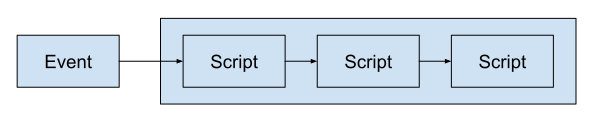
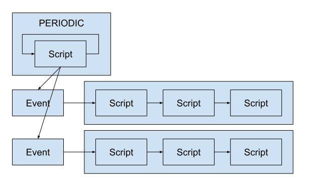
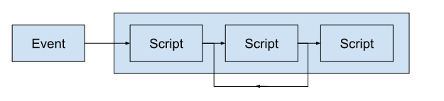
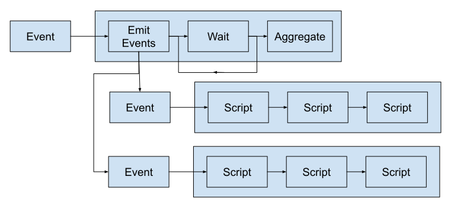

# Концепция

<!--
- блоки, блок-схема
- блоки делятся по смыслу, технологической необходимости, перезапуск
- блоки соединяются графом - ветвление, параллелизация, цикл 
- рождалась в результате практической эксплуатации
- сначала усложнялась, потом упрощалась
- главное - простота
- при должном навыке можно получить желаемый функционал 
-->

Задача обработки данных обычно разбивается на функциональные блоки, связи между
которыми формируют алгоритмический граф обработки данных. Если этот граф
достаточно простой и состоит в основном из последовательных цепочек блоков с
небольшим кол-вом ветвлений, то можно значительно упростить код планировщика и
наглядность интерфейса администратора. Многолетний опыт показывает, что
концептуально простую Систему обслуживать гораздо проще.

Давайте рассмотрим типичные примеры алгоритмических графов, которые можно
реализовать в alt_processing.

---

Простой вариант цепочки Скриптов по Событию. 

---

Скрипт периодической Задачи при обнаружении новых данных генерирует События на
обработку. События могут быть одной Задачи или разных для разных типов данных.
События могут обрабатываться параллельно при наличии ресурсов.

---

Один из Скриптов перезапускается до тех пор, пока не выполнится условие.
Например, до тех пор пока какая-нибудь операция (например, сетевой запрос) не
выполнится успешно.

---

Первичная Задача состоит из трех Скриптов. Первый Скрипт анализирует параметры и
генерирует События вторичной Задачи, которые обрабатываются параллельно. Второй
Скрипт первичной Задачи, перезапускаясь, ждет окончания Обработок вторичной
Задачи. По окончанию вторичных Обработок третий Скрипт завершает Обработку 
агрегируя результаты вторичных Обработок.
 
