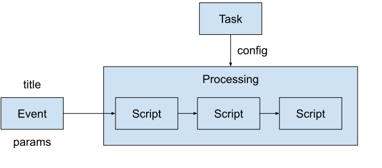

# Терминология

### Проект (Project)

Папка, содержащая Скрипты пользовательского проекта. При конфигурации Задачи указывается
название Проекта и название конфигурационного файла Задачи, в котором указывается
последовательность Скриптов Обработки. Исходя из заданной структуры директорий Система
знает где искать нужные ей файлы.

### Задача (Task)

Конфигурация будущей Обработки, которая будет создана при старте или при появлении
События. Состоит из типа Задачи, Проекта, уникального имени и прочих параметров,
определяющих поведение будущей Обработки.

Типы Задачи:

* **PERIODIC** - периодическая (задается период времени между запусками)
* **EVENT** - по Событию (в котором содержатся параметры)

### Событие (Event)

Задание на будущую Обработку. Содержит название Задачи, название События и параметры в
произвольной форме. Задача задает последовательность Скриптов. Название События
отображается в интерфейсе и позволяет наглядно идентифицировать, что данная Обработка
делает.

### Обработка (Processing)

<!--
- обработка - это факт выполнения скриптов
- инициируется только при наличии ресурсов
- основано на Задаче
-->

Обработка - это собственно процесс выполнения последовательности Скриптов, составляющих
Обработку. Этот процесс инициируется из События только при наличии свободных ресурсов для
ее выполнения. Создается временные рабочие директории Обработки и Скриптов.

### Скрипт (Script)

Файл программы на Питоне, находящийся внутри папки Проекта и запускаемый Планировщиком при
наличии свободных ресурсов для ее выполнения. Параметры для работы Скрипт получает из
События, на базе которого была создана Обработка. Скрипт работает во временной папке,
созданной во временной папке Обработки.

### Система (System)

Автоматическая система, построенная на базе фреймворка alt_processing. 
Получается из alt_processing добавлением пользовательских Проектов с 
пользовательскими Скриптами.
