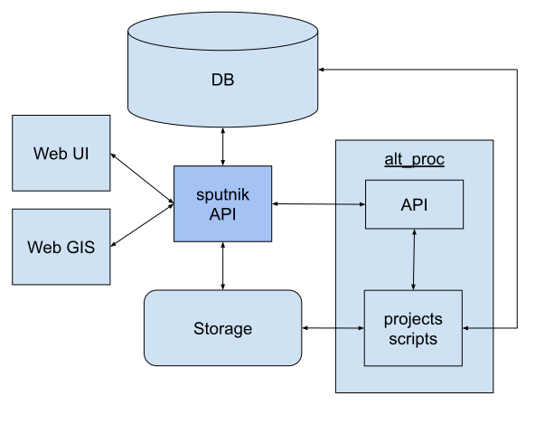

# Архитектура

### Sputnik API
Интерфейс взаимодействия с остальными частями Системы.
- получает команды от административного интерфейса
- формирует задания на обработку системе alt_proc
- формирует продукты для показа в Web GIS

### DB (База Данных)
База Данных для хранения данных проектов
- данные проекта
- метаданные сцен
- метаданные продуктов 

### Storage (Хранилище)
Хранилище файлов
- исходных данных
- готовых продуктов
- объемных временных файлов

### Web UI
Административных веб интерфейс

### Web GIS
Картографическая часть веб интерфейса

### alt_proc
Система alt_processing - Система автоматизации обработки
Включает в себя API для взаимодействия и проекты, содержащие скрипты для 
выполнения обработки. Готовые продукты обработки записываются в Хранилище.
 
 